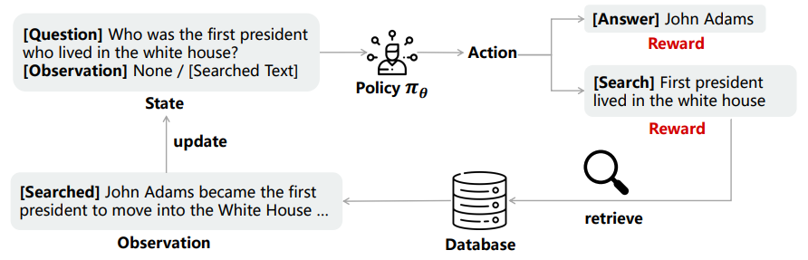

<h1 align="center"> SmartRAG: Jointly Learn RAG-Related Tasks From the Environment Feedback </h1>


This includes the original implementation of [SmartRAG: Jointly Learn RAG-Related Tasks From the Environment Feedback](https://arxiv.org/pdf/2410.18141) (ICLR 2025) by Jingsheng Gao, Linxu Li, Ke Ji, Weiyuan Li, Yixin Lian, yuzhuo fu, Bin Dai. 

**SmartRAG** a system that includes a policy network and a retriever. We argue that a system like RAG that incorporates multiple modules should be jointly optimized to achieve optimal performance. The policy network can serve as 1) a decision maker that decides when to retrieve, 2) a query rewriter to generate a query most suited to the retriever and 3) an answer generator that produces the final response with/without the observations.

We then propose to jointly optimize the whole system using a reinforcement learning algorithm, with the reward designed to encourage the system to achieve the highest performance with minimal retrieval cost. When jointly optimized, each module can be aware of how other modules are working and thus find the best way to work together as a complete system. Empirical results demonstrate that the jointly optimized system can achieve better performance than separately optimized counterparts.



If you find our code or the paper useful, please cite the paper:

# Citation

```bibtex
@inproceedings{
gao2025smartrag,
title={Smart{RAG}: Jointly Learn {RAG}-Related Tasks From the Environment Feedback},
author={Jingsheng Gao and Linxu Li and Ke Ji and Weiyuan Li and Yixin Lian and yuzhuo fu and Bin Dai},
booktitle={The Thirteenth International Conference on Learning Representations},
year={2025},
url={https://openreview.net/forum?id=OCd3cffulp}
}
```
## Local Enviroment Installation
```
git clone https://github.com/gaojingsheng/SmartRAG

conda create -n SmartRAG python=3.8

conda activate SmartRAG

pip install --upgrade "pip<24.1"

pip install setuptools==57.5.0

pip install gym==0.21.0

cd SmartRAG/rl

pip install -e .
```

## Two-Stage Training of SmartRAG

### Warm-up Supervised Fine-tuning
For the fine-tuning of Flan-T5, run the following command: 
```
cd sft/t5
python main.py
```
For the fine-tuning of LlaMa-7B, we refer to the fine-tuning code of [SelfRAG](https://github.com/AkariAsai/self-rag).

### Joint Training of Reinforcement Learning
For the PPO training of Flan-T5, run the following command: 
```
python scripts/training/train_text_generation.py --config_path scripts/training/task_configs/three/t5_large_ppo.yml --experiment_name t5_large_ppo
```
For the PPO training of LlaMa-7B, run the following command: 
```
python scripts/training/train_text_generation.py --config_path scripts/training/task_configs/three/llama7b_ppo.yml --experiment_name llama7b_ppo
```

## Inference and Evaluate of SmartRAG

```
cd inference 

python evaluate_retrieval_t5.py --base_model_path your_sft_model_path --checkpoint your_ppo_checkpoint_path 
``` 


### Acknowledgement

Many thanks to

[RL4LM](https://github.com/allenai/RL4LMs): Is Reinforcement Learning (Not) for Natural Language Processing?: Benchmarks, Baselines, and Building Blocks for Natural Language Policy Optimization

[SelfRAG](https://github.com/AkariAsai/self-rag): SELF-RAG: Learning to Retrieve, Generate and Critique through Self-reflection

